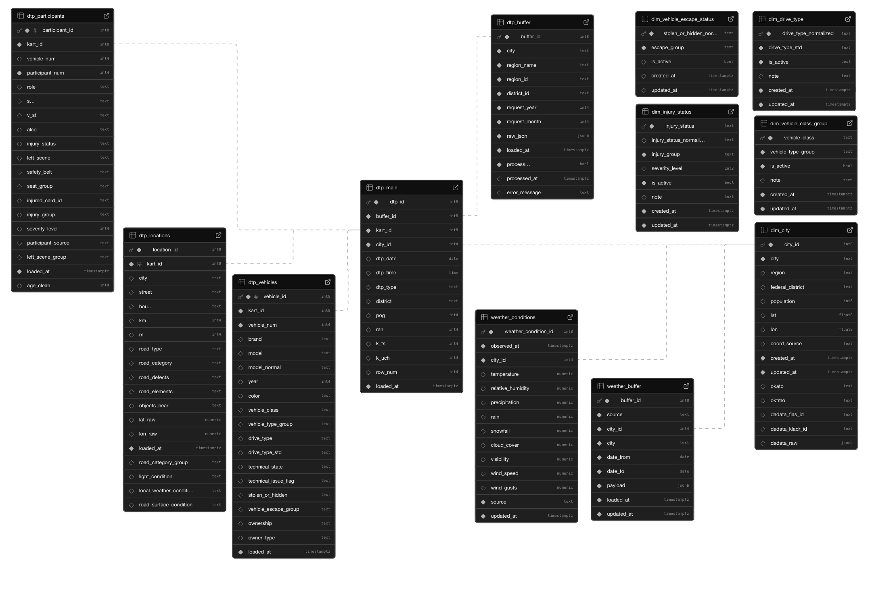

# Анализ влияния погодных условий на ДТП в российских городах

## Цель проекта

Целью проекта является создание аналитического решения для исследования влияния погодных условий на дорожно-транспортные происшествия в российских городах. Для реализации этой цели необходимо разработать ETL-пайплайн, который будет собирать данные из API ГИБДД, Open-Meteo, DaData и веб-парсинга Wikipedia, обрабатывать, обогащать и хранить их в PostgreSQL для последующей визуализации и анализа.

---

## Содержание

### Этап 1. Сбор и первичная подготовка данных
#### Этап 1.1. Сбор списка городов
- веб-парсинг списка городов России с Wikipedia
- формирование справочника городов

#### Этап 1.2. Обогащение справочной информации по городам
- получение координат, ОКАТО и ОКТМО через API DaData
- обогащение справочника городов

#### Этап 1.3. Загрузка погодных данных
- получение погодных данных через API Open-Meteo
- загрузка исходных данных в буферную таблицу `weather_buffer`

#### Этап 1.4. Загрузка данных о ДТП
- получение данных о ДТП через API ГИБДД
- загрузка исходных данных в буферную таблицу `dtp_buffer`

### Этап 2. Создание базы данных
- проектирование структуры базы данных в PostgreSQL
- создание таблиц для хранения справочной информации, погодных данных и данных о ДТП
- настройка ключей, ограничений и индексов

### Этап 3. Обработка и нормализация данных
#### Этап 3.1. Обработка погодных данных
- преобразование RAW JSON из `weather_buffer`
- загрузка почасовых погодных наблюдений в `weather_conditions`

#### Этап 3.2. Обработка данных о ДТП
- загрузка основной информации о ДТП в `dtp_main`
- загрузка данных о местоположении и дорожных условиях в `dtp_locations`
- загрузка данных об участниках ДТП в `dtp_participants`
- загрузка данных о транспортных средствах в `dtp_vehicles`

### Этап 4. Подготовка аналитических витрин
- создание SQL-представлений для объединения погодных данных и данных о ДТП
- подготовка агрегированных витрин по участникам, транспортным средствам и погодным условиям
- формирование структуры данных для сравнительного анализа городов

### Этап 5. Построение дашборда
- подключение базы данных PostgreSQL к Yandex DataLens
- создание интерактивного BI-дашборда
- разработка вкладок для анализа:
  - общего профиля ДТП
  - погодных условий
  - дорожных условий
  - участников и транспорта

### Этап 6. Аналитическая интерпретация результатов
- анализ влияния погодных условий на аварийность
- сравнение Кемерово и Ставрополя по ключевым показателям ДТП
- формулировка выводов и подготовка аналитической записки по результатам исследования

---

## Обзор проекта

Проект включает этапы:

- Веб-парсинг списка городов России с Wikipedia
- Загрузка и обработка справочной информации по городам через API DaData (ОКАТО / ОКТМО)
- Определение структуры базы данных и проектирование схемы хранения данных в PostgreSQL
- Загрузка погодных данных через API Open-Meteo в буферную таблицу
- Преобразование погодных данных из RAW JSON в нормализованную почасовую таблицу погодных условий
- Загрузка данных о ДТП через API ГИБДД в буферную таблицу
- Поэтапная загрузка и нормализация данных о ДТП в основные таблицы:
  - общая информация о ДТП
  - дорожные условия и местоположение ДТП
  - участники ДТП
  - транспортные средства
- Подготовка витрин для анализа и визуализации
- Подключение базы данных к инструменту визуализации данных
- Разработка и реализация аналитического дашборда

Итог:

- Подготовлен ETL-пайплайн: сбор данных из внешних источников, загрузка в буферные таблицы, очистка, нормализация, обогащение и загрузка в аналитическую модель PostgreSQL
- Реализован BI-дашборд в Yandex DataLens для анализа влияния погодных условий на ДТП в российских городах

## Стек

- **Python:** requests, pandas, SQLAlchemy, python-dotenv, geopy
- **PostgreSQL**
- **BI:** Yandex DataLens

---

### Этап 1. Сбор и первичная подготовка данных

#### Этап 1.1. Сбор списка городов

**Python-скрипт:**
- `scripts/load_cities_from_wiki.py`

**Источник данных:**
- Wikipedia: список городов России  
  `https://ru.wikipedia.org/wiki/Список_городов_России`

**Что делает скрипт:**
- Выполняет веб-парсинг HTML-таблицы со страницы Wikipedia
- Извлекает справочник городов России
- Определяет и сохраняет ключевые атрибуты:
  - `city` — название города
  - `region` — субъект РФ
  - `federal_district` — федеральный округ
  - `population` — численность населения
- Выполняет первичную очистку данных:
  - удаляет сноски вида `[1]`, `[2]`
  - очищает численность населения от лишних символов
  - приводит поле `population` к числовому типу
  - удаляет пустые строки
  - удаляет дубликаты по ключу `(city, region)`

**Загрузка в базу данных:**
- Первичная загрузка справочника городов выполняется в таблицу:
  - `public.dim_city`
- Используется UPSERT по ключу:
  - `(city, region)`
- При первичной загрузке координаты записываются как:
  - `lat = NULL`
  - `lon = NULL`
  - `coord_source = 'pending'`

**Дополнительное обогащение в рамках этапа:**
- После загрузки справочника скрипт выбирает города без координат
- Выполняет геокодирование через `Nominatim` (OpenStreetMap)
- Для каждого города формирует поисковый запрос:
  - `city, region, Russia`
- Загружает координаты:
  - `lat`
  - `lon`
- Обновляет таблицу `public.dim_city` через UPSERT
- Сохраняет источник координат в поле:
  - `coord_source`

**Ограничения и особенности:**
- Геокодирование выполняется с ограничением частоты запросов:
  - `1 запрос в секунду`
- Используется `RateLimiter` для корректной работы с Nominatim
- Прогресс геокодирования выводится в консоль каждые `25` городов

**Результат этапа:**
- Сформирован и загружен базовый справочник городов России в таблицу `public.dim_city`
- Таблица содержит:
  - названия городов
  - регионы
  - федеральные округа
  - численность населения
  - координаты городов (при успешном геокодировании)

---

#### Этап 1.2. Обогащение справочной информации по городам

**Python-скрипт:**
- `scripts/load_cities_dadata_okato_oktmo.py`

**Источник данных:**
- API DaData  
  `https://suggestions.dadata.ru/suggestions/api/4_1/rs/suggest/address`

**Что делает скрипт:**
- Подключается к базе данных PostgreSQL
- Выбирает из таблицы `public.dim_city` города, для которых ещё не заполнены:
  - `okato`
  - `oktmo`
- Для каждого города формирует поисковый запрос в формате:
  - `город, регион, Россия`
- Отправляет запрос в API DaData с ограничением уровня поиска до значения:
  - `city`
- Получает наиболее релевантный вариант города из блока `suggestions`

**Какие данные извлекаются:**
- `okato` — код ОКАТО
- `oktmo` — код ОКТМО
- `fias_id` — идентификатор ФИАС
- `kladr_id` — идентификатор КЛАДР

**Обновление справочника городов:**
- Для каждого города обновляется таблица:
  - `public.dim_city`
- Обновляются поля:
  - `okato`
  - `oktmo`
  - `dadata_fias_id`
  - `dadata_kladr_id`
- При включённом параметре `SAVE_RAW_TO_DB = True` в таблицу также сохраняется:
  - `dadata_raw` — сырой JSON-ответ DaData
- Время последнего обновления записывается в:
  - `updated_at`

**Ограничения и особенности:**
- Между запросами к API используется пауза:
  - `0.25 секунды`
- Скрипт обрабатывает только города, которым требуется обогащение
- Для каждого города в лог выводится результат:
  - найден / не найден
  - заполненные значения `okato` и `oktmo`

**Результат этапа:**
- Справочник городов `public.dim_city` обогащён кодами ОКАТО и ОКТМО
- Дополнительно сохранены идентификаторы ФИАС / КЛАДР и сырой ответ API DaData
- Подготовлен расширенный справочник городов для дальнейшей загрузки и аналитики данных о погоде и ДТП

---

#### Этап 1.3. Загрузка погодных данных

**Python-скрипт:**
- `scripts/load_weather_buffer.py`

**Источник данных:**
- API Open-Meteo (Archive API)  
  `https://archive-api.open-meteo.com/v1/archive`

**Что делает скрипт:**
- Подключается к базе данных PostgreSQL
- Выбирает из таблицы `public.dim_city` города с заполненными координатами:
  - `city_id`
  - `city`
  - `lat`
  - `lon`
- Для каждого города определяет, какие годы уже загружены в таблицу `public.weather_buffer`
- Формирует годовые диапазоны внутри заданного периода загрузки
- Для каждого диапазона отправляет запрос в API Open-Meteo и получает почасовые погодные данные в формате JSON

**Какие погодные параметры загружаются:**
- `temperature_2m` — температура воздуха
- `relative_humidity_2m` — относительная влажность
- `precipitation` — осадки
- `rain` — дождь
- `snowfall` — снег
- `cloud_cover` — облачность
- `visibility` — видимость
- `wind_speed_10m` — скорость ветра
- `wind_gusts_10m` — порывы ветра

**Логика загрузки:**
- Данные загружаются по годовым интервалам
- Для каждого города и периода в таблицу `public.weather_buffer` записывается:
  - `source`
  - `city_id`
  - `city`
  - `date_from`
  - `date_to`
  - `payload` — сырой JSON-ответ API
- Используется UPSERT по ключу:
  - `(source, city_id, date_from, date_to)`

**Инкрементальная логика:**
- Годы, которые уже загружены в буфер, пропускаются
- Последние `N` лет (по умолчанию `1 год`) перезагружаются при каждом запуске
- Это позволяет регулярно обновлять текущий год без ручной очистки таблицы

**Параметры запуска:**
- `--cities` — список городов для загрузки
- `--start-date` — дата начала периода
- `--end-date` — дата окончания периода
- `--lookback-years` — количество последних лет, которые нужно перезагружать

**Ограничения и особенности:**
- В запросе к API используется временная зона:
  - `UTC`
- После каждой загрузки используется небольшая пауза между запросами:
  - `0.5 секунды`
- Скрипт выводит в лог:
  - список загружаемых городов
  - период загрузки
  - годы, попадающие в зону refresh
  - статистику по каждому городу и общую статистику по запуску

**Результат этапа:**
- Погодные данные по выбранным городам загружены в буферную таблицу `public.weather_buffer`
- В таблице хранится сырой JSON-ответ Open-Meteo по каждому городу и годовому периоду
- Подготовлен буферный слой для дальнейшего преобразования погодных данных в аналитическую почасовую таблицу

---

#### Этап 1.4. Загрузка данных о ДТП

**Python-скрипт:**
- `scripts/load_dtp_to_buffer.py`

**Источник данных:**
- API ГИБДД  
  `http://stat.gibdd.ru/map/getDTPCardData`

**Что делает скрипт:**
- Подключается к базе данных PostgreSQL
- Загружает данные по ДТП для выбранных городов:
  - Ставрополь
  - Кемерово
- Формирует список месяцев для загрузки:
  - с `2015-01` по текущий месяц включительно
- Для каждого города и месяца отправляет запрос в API ГИБДД и получает сырые данные о ДТП в формате JSON

**Особенности запроса к API:**
- Используется endpoint:
  - `getDTPCardData`
- Для каждого запроса передаются параметры:
  - `ParReg` — код региона
  - `reg` — код муниципального образования
  - `date` — месяц и год запроса
  - `fieldNames` — перечень полей карточек ДТП
- Ответ API содержит поле `data` в формате JSON-строки, которое затем декодируется в Python-словарь

**Какие данные загружаются:**
- сырые карточки ДТП за каждый месяц
- служебная информация о городе и параметрах запроса
- признаки ошибок загрузки при неуспешных запросах

**Логика загрузки:**
- Данные загружаются помесячно
- Для каждого города и месяца выполняется проверка, существует ли уже запись в буферной таблице
- Если запись уже есть, месяц пропускается
- Если запись отсутствует, выполняется загрузка данных и запись в буфер

**Запись в базу данных:**
- Данные сохраняются в таблицу:
  - `public.dtp_buffer`
- Для каждой записи сохраняются поля:
  - `city`
  - `region_name`
  - `region_id`
  - `district_id`
  - `request_year`
  - `request_month`
  - `raw_json` — сырой JSON-ответ API
  - `error_message` — сообщение об ошибке, если запрос выполнен некорректно
- Внутрь `raw_json` дополнительно записывается блок `_meta` с контекстом загрузки:
  - город
  - регион
  - параметры запроса
  - дата и время загрузки

**Обработка ошибок и устойчивость загрузки:**
- Для сетевых ошибок используется retry-механизм
- Максимальное число повторных попыток:
  - `4`
- Используется экспоненциальная задержка между ретраями
- Если запрос неуспешен, в таблицу всё равно записывается техническая строка с ошибкой, чтобы фиксировать факт попытки загрузки

**Ограничения и особенности:**
- Между запросами к API используется пауза:
  - `0.4 секунды`
- Скрипт позволяет безопасно перезапускать загрузку без образования дублей
- В лог выводится:
  - город
  - год и месяц
  - количество полученных карточек ДТП
  - наличие ошибок при загрузке

**Результат этапа:**
- Сырые данные о ДТП по каждому городу и месяцу загружены в буферную таблицу `public.dtp_buffer`
- Подготовлен буферный слой для последующей нормализации данных о ДТП в аналитические таблицы

  ---

### Этап 2. Создание базы данных

База данных PostgreSQL развернута на платформе **Supabase**.

**Диаграмма базы данных:**

Схема базы данных построена по логике нормализованной аналитической модели и включает:

- справочники
- буферные таблицы для сырых данных
- основные факт-таблицы ДТП
- таблицу погодных условий

**Справочные таблицы:**
- `dim_city` — справочник городов РФ
- `dim_injury_status` — нормализация статусов травм участников ДТП
- `dim_vehicle_class_group` — нормализация классов транспортных средств
- `dim_drive_type` — нормализация типов привода
- `dim_vehicle_escape_status` — нормализация статусов скрытия ТС с места ДТП

**Буферные таблицы:**
- `dtp_buffer` — сырые JSON-ответы по ДТП из API ГИБДД
- `weather_buffer` — сырые JSON-ответы по погодным данным из API Open-Meteo

**Основные таблицы ДТП:**
- `dtp_main` — основная информация по ДТП
- `dtp_locations` — местоположение ДТП и дорожные условия
- `dtp_participants` — участники ДТП
- `dtp_vehicles` — транспортные средства, участвовавшие в ДТП

**Таблица погодных условий:**
- `weather_conditions` — почасовые погодные наблюдения по городам

**Логика связей в модели данных:**
- `dim_city` используется как единый справочник городов для данных о погоде и ДТП
- `dtp_buffer` связан с `dtp_main` через `buffer_id`
- `dtp_main` является центральной факт-таблицей ДТП
- `dtp_locations`, `dtp_participants`, `dtp_vehicles` связаны с `dtp_main` по `kart_id`
- `weather_buffer` и `weather_conditions` связаны с `dim_city` по `city_id`

**Иерархия связей:**
- `dim_city` → `weather_buffer` → `weather_conditions`
- `dim_city` → `dtp_main`
- `dtp_buffer` → `dtp_main`
- `dtp_main` → `dtp_locations`
- `dtp_main` → `dtp_participants`
- `dtp_main` → `dtp_vehicles`

В базе данных реализованы:
- первичные ключи (`PRIMARY KEY`)
- уникальные ограничения (`UNIQUE`)
- внешние ключи (`FOREIGN KEY`)
- аналитические индексы для ускорения фильтрации и join-операций

**Настроенные ограничения и индексы позволяют:**
- исключать дублирование данных
- поддерживать целостность связей между таблицами
- ускорять аналитические запросы по дате, городу, типу ДТП, погодным условиям и характеристикам участников

**Загрузка данных в базу данных выполняется поэтапно:**
- сначала данные поступают в буферные таблицы
- затем проходят очистку, нормализацию и распределяются по целевым таблицам аналитической модели

---

### Этап 3. Обработка и нормализация данных
#### Этап 3.1. Обработка погодных данных

**Python-скрипт:**
- `scripts/load_weather_conditions.py`

**Источник данных:**
- буферная таблица `public.weather_buffer`

**Что делает скрипт:**
- Подключается к базе данных PostgreSQL
- Выбирает записи из буферной таблицы `public.weather_buffer` по заданному источнику и выбранным городам
- Извлекает из поля `payload` блок `hourly` с почасовыми погодными наблюдениями
- Преобразует массивы погодных значений в отдельные почасовые строки
- Загружает результат в целевую таблицу `public.weather_conditions`

**Какие данные извлекаются из RAW JSON:**
- `time` — дата и время наблюдения
- `temperature_2m` — температура воздуха
- `relative_humidity_2m` — относительная влажность
- `precipitation` — осадки
- `rain` — дождь
- `snowfall` — снег
- `cloud_cover` — облачность
- `visibility` — видимость
- `wind_speed_10m` — скорость ветра
- `wind_gusts_10m` — порывы ветра

**Логика обработки:**
- Для каждого города определяется watermark:
  - максимальное значение `observed_at` в таблице `public.weather_conditions`
- По умолчанию скрипт работает инкрементально:
  - загружает только новые погодные часы
  - дополнительно перезагружает небольшой хвост данных по параметру `lookback_hours`
- При включении `full_refresh = true` таблица `public.weather_conditions` очищается и пересобирается полностью

**Валидация данных:**
- Проверяется наличие блока `hourly` в JSON
- Проверяется наличие массива `time`
- Проверяется согласованность длин погодных массивов
- При ошибках JSON или несоответствии длины массивов строка буфера пропускается и фиксируется в статистике загрузки

**Запись в базу данных:**
- Данные сохраняются в таблицу:
  - `public.weather_conditions`
- Используется UPSERT по ключу:
  - `(source, city_id, observed_at)`
- Обновляются значения погодных параметров и `updated_at`

**Параметры запуска:**
- `--cities` — список городов для обработки
- `--source` — источник данных
- `--full-refresh` — полная пересборка таблицы
- `--lookback-hours` — количество часов хвоста для инкрементальной догрузки
- `--batch-size-buffers` — размер батча по `weather_buffer`
- `--insert-chunk-size` — размер чанка для UPSERT в `weather_conditions`

**Ограничения и особенности:**
- Обработка выполняется батчами по строкам `weather_buffer`
- Вставка в `weather_conditions` дополнительно разбивается на внутренние чанки для безопасного UPSERT больших объёмов
- Время из Open-Meteo интерпретируется как UTC
- В лог выводятся:
  - количество обработанных буферных строк
  - число часов до и после watermark
  - число записанных строк
  - число ошибок JSON и проблемных payload

**Результат этапа:**
- RAW JSON из `public.weather_buffer` преобразован в нормализованные почасовые погодные наблюдения
- Таблица `public.weather_conditions` содержит готовые для аналитики погодные данные по городам и времени наблюдения
- Подготовлен погодный слой данных для последующего объединения с данными о ДТП

---

#### Этап 3.2. Обработка данных о ДТП

**Загрузка основной информации о ДТП в `dtp_main`**

**Python-скрипт:**
- `scripts/load_dtp_main.py`

**Источник данных:**
- буферная таблица `public.dtp_buffer`

**Что делает скрипт:**
- Подключается к базе данных PostgreSQL
- Выбирает из таблицы `public.dtp_buffer` буферные записи по заданным городам
- Обрабатывает только те строки, в которых:
  - поле `raw_json->'tab'` является массивом
  - массив карточек ДТП не пустой
- Преобразует массив карточек ДТП в строки основной факт-таблицы `public.dtp_main`

**Какие данные извлекаются из буфера:**
- `KartId` — идентификатор карточки ДТП
- `date` — дата ДТП
- `Time` — время ДТП
- `DTP_V` — тип ДТП
- `District` — район
- `POG` — количество погибших
- `RAN` — количество раненых
- `K_TS` — количество транспортных средств
- `K_UCH` — количество участников
- `rowNum` — номер строки в исходной выгрузке

**Логика обработки:**
- Для каждой записи из `dtp_buffer` выполняется распаковка массива `raw_json->'tab'`
- Каждая карточка ДТП преобразуется в одну строку таблицы `public.dtp_main`
- Для города дополнительно определяется:
  - `city_id` из справочника `public.dim_city`
- Обработка выполняется батчами по `buffer_id`

**Пагинация и устойчивость загрузки:**
- Используется keyset pagination по `buffer_id`
- Такой подход позволяет:
  - стабильно обрабатывать большие объёмы данных
  - избегать проблем, связанных с `OFFSET`
  - безопасно продолжать загрузку при росте таблицы буфера

**Режимы загрузки:**
- **incremental** — режим по умолчанию  
  выполняется безопасная догрузка новых буферных записей
- **full refresh** — полная пересборка таблицы  
  при включении `full_refresh = true` таблица `public.dtp_main` очищается и загружается заново

**Запись в базу данных:**
- Данные сохраняются в таблицу:
  - `public.dtp_main`
- Используется вставка с защитой от дублей:
  - `ON CONFLICT (kart_id) DO NOTHING`
- Это обеспечивает идемпотентность повторных запусков

**Дополнительная логика:**
- При необходимости буферные записи могут помечаться как обработанные:
  - `processed = true`
  - `processed_at = now()`
- По завершении загрузки могут выполняться проверки качества данных:
  - отсутствие дублей по `kart_id`
  - отсутствие `NULL` в `kart_id`

**Параметры запуска:**
- `DTP_CITIES` — список городов
- `DTP_BATCH_SIZE` — размер батча по буферным строкам
- `DTP_ONLY_UNPROCESSED` — брать только необработанные записи из буфера
- `DTP_MARK_PROCESSED` — помечать буфер как обработанный
- `DTP_FULL_REFRESH` — полная пересборка таблицы
- `DTP_DRY_RUN` — тестовый запуск без вставки
- `DTP_RUN_CHECKS` — выполнение QA-проверок после загрузки

**Результат**
- Из буферной таблицы `public.dtp_buffer` загружена и нормализована основная информация о ДТП
- Таблица `public.dtp_main` содержит по одной строке на каждую карточку ДТП
- Подготовлена центральная факт-таблица для дальнейшей загрузки данных о местоположении, участниках и транспортных средствах
---
**Загрузка данных о местоположении и дорожных условиях в `dtp_locations`**

**Python-скрипт:**
- `scripts/load_dtp_locations.py`

**Источник данных:**
- буферная таблица `public.dtp_buffer`

**Что делает скрипт:**
- Подключается к базе данных PostgreSQL
- Выбирает из таблицы `public.dtp_buffer` буферные записи по заданным городам
- Обрабатывает JSON-ответы API ГИБДД и извлекает из каждой карточки ДТП данные о местоположении и дорожной среде
- Преобразует массив карточек ДТП в строки целевой таблицы `public.dtp_locations`

**Какие данные извлекаются из буфера:**
- `KartId` — идентификатор карточки ДТП
- `n_p` — населённый пункт
- `street` — улица
- `house` — дом
- `km` — километр
- `m` — метр
- `COORD_W` — широта
- `COORD_L` — долгота
- `k_ul` — тип дороги
- `dor_z` — категория дороги
- `osv` — условия освещённости
- `s_pog` — локальные погодные условия
- `s_pch` — состояние дорожного покрытия
- `ndu` — дефекты дороги
- `sdor` — элементы дороги
- `OBJ_DTP` — объекты рядом с местом ДТП

**Логика обработки:**
- Для каждой записи из `dtp_buffer` выполняется распаковка массива `raw_json->'tab'`
- Из каждой карточки ДТП извлекается вложенный блок `infoDtp`
- Поля местоположения, дорожной инфраструктуры и дорожных условий приводятся к нормализованному виду
- Списковые поля преобразуются в строковый формат через разделитель ` | `
- Категория дороги дополнительно агрегируется в укрупнённую группу:
  - `местная`
  - `региональная`
  - `федеральная`
  - `не указано`
  - `прочее`

**Преобразования данных:**
- координаты приводятся к числовому формату
- поля `km` и `m` приводятся к целому типу
- текстовые поля очищаются от пустых значений
- списковые поля дорожной среды нормализуются в единый формат хранения

**Пагинация и устойчивость загрузки:**
- Используется keyset pagination по `buffer_id`
- Такой подход позволяет:
  - безопасно обрабатывать большие объёмы данных
  - избегать проблем, связанных с `OFFSET`
  - стабильно продолжать загрузку батчами

**Режимы загрузки:**
- Скрипт работает в инкрементальном режиме
- Даже при включении `full_refresh = true` полная очистка таблицы не выполняется
- В лог выводится предупреждение, что принудительная очистка отключена

**Запись в базу данных:**
- Данные сохраняются в таблицу:
  - `public.dtp_locations`
- Используется два режима обработки конфликтов:
  - `update` — обновление существующей строки по `kart_id`
  - `nothing` — пропуск дублей
- По умолчанию используется режим:
  - `update`

**Параметры запуска:**
- `--cities` — фильтр по городам
- `--batch-size` — размер батча по буферным строкам
- `--full-refresh` — логический флаг полной загрузки
- `--conflict-mode` — режим обработки конфликтов (`update` / `nothing`)

**Ограничения и особенности:**
- обработка выполняется батчами по `buffer_id`
- UPSERT выполняется чанками для безопасной записи крупных объёмов
- при временных сбоях БД используется retry-механизм для отдельных чанков
- в лог выводятся:
  - диапазон `buffer_id` по батчу
  - количество обработанных карточек
  - число записанных строк
  - число записей без координат
  - число ошибок JSON

**Результат**
- Из буферной таблицы `public.dtp_buffer` загружены и нормализованы данные о местоположении ДТП и дорожных условиях
- Таблица `public.dtp_locations` содержит по одной строке на каждую карточку ДТП с адресной информацией, координатами и характеристиками дорожной среды
- Подготовлен слой географических и инфраструктурных данных для дальнейшего анализа дорожных факторов ДТП
